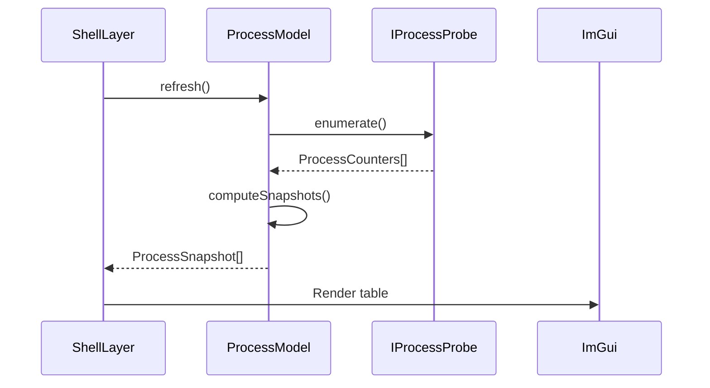

# Code Review Issues

This document contains all identified code review feedback that should be converted to GitHub issues.

## Priority Legend
- 🔴 Critical - Security, crashes, data loss
- 🟡 Important - Correctness, performance, maintainability  
- 🟢 Nice to have - Style, documentation, quality of life

---

## Disabled Clang-Tidy Checks - Re-enable Recommendations

### 🟡 Issue: Re-enable `misc-const-correctness`
**Category:** Code Quality  
**Current Status:** Disabled in `.clang-tidy`  
**Reason for Disabling:** "Too noisy; many false positives with locks and iterators"

**Recommendation:** Re-enable with selective NOLINT comments

**Justification:**
- `const`-correctness is a fundamental C++ best practice that prevents accidental mutations
- Modern C++23 code should embrace const-by-default
- The check helps catch bugs where variables are modified unintentionally
- False positives with locks and iterators are rare and can be suppressed with targeted `// NOLINT(misc-const-correctness)` comments
- TODO.md already acknowledges this should be re-enabled: "Worth enabling with more targeted NOLINT comments"

**Action Items:**
1. Enable the check in `.clang-tidy`
2. Run clang-tidy and review all findings
3. Apply const where appropriate
4. Add NOLINT comments for legitimate false positives (locks, iterators)
5. Document patterns that require NOLINT in coding guidelines

---

### 🟢 Issue: Re-enable `readability-convert-member-functions-to-static`
**Category:** Code Quality  
**Current Status:** Disabled in `.clang-tidy`  
**Reason for Disabling:** "Methods may need `this` in future; premature optimization"

**Recommendation:** Re-enable to identify dead code and improve clarity

**Justification:**
- Methods that don't access instance state are more clearly expressed as static
- Static methods signal to readers that the function is stateless
- Helps identify methods that might belong in a utility namespace instead
- "May need `this` in future" is speculative - YAGNI principle suggests making it static now
- Easy to make non-static later if actually needed
- TODO.md acknowledges: "Good for finding dead code"

**Action Items:**
1. Enable the check
2. Review findings and make methods static where appropriate
3. Consider moving pure utility functions to free functions or utility namespaces

---

### 🟡 Issue: Re-enable `performance-unnecessary-value-param`
**Category:** Performance  
**Current Status:** Disabled in `.clang-tidy`  
**Reason for Disabling:** "False positives with std::stop_token and similar"

**Recommendation:** Re-enable with targeted NOLINT for stop_token

**Justification:**
- Passing large objects by value when const& would suffice is a real performance issue
- The check catches unnecessary copies that hurt performance
- `std::stop_token` is specifically designed to be passed by value (it's a handle), but this is a rare exception
- Other types flagged are likely legitimate issues
- TODO.md acknowledges: "Worth fixing with explicit moves"

**Action Items:**
1. Enable the check
2. Add NOLINT for std::stop_token parameters (which should be by-value)
3. Fix other findings by using const& or explicit std::move

---

### 🟢 Issue: Re-enable `modernize-use-auto`
**Category:** Code Modernization  
**Current Status:** Disabled in `.clang-tidy`  
**Reason for Disabling:** "Explicit types preferred for clarity in this codebase"

**Recommendation:** Re-enable selectively or reconsider

**Justification:**
- C++23 projects should embrace modern idioms
- `auto` reduces verbosity and improves maintainability when type is obvious from context
- Examples where auto is clearer:
  - `auto widget = std::make_unique<Widget>()` vs `std::unique_ptr<Widget> widget = std::make_unique<Widget>()`
  - `auto it = container.begin()` vs `Container::iterator it = container.begin()`
- Can configure the check to only flag obvious cases

**Counter-argument:**
- Explicit types can aid readability, especially for newcomers
- This is somewhat subjective and depends on team preference

**Action Items:**
1. Team discussion on auto usage policy
2. If consensus is to use auto, enable the check
3. If keeping explicit types, document reasoning in coding guidelines

---

### 🟢 Issue: Re-enable `modernize-use-scoped-lock` (Conditional)
**Category:** Code Modernization  
**Current Status:** Disabled in `.clang-tidy`  
**Reason for Disabling:** "`std::lock_guard` is sufficient for single-mutex locks"

**Recommendation:** Consider enabling for consistency and future-proofing

**Justification:**
- `std::scoped_lock` is the preferred C++17+ RAII lock guard
- Works for both single and multiple mutexes
- Same performance as `std::lock_guard` for single mutex
- Provides consistency - one locking idiom throughout codebase
- Easier to upgrade to multi-mutex locking if needed

**Counter-argument:**
- `std::lock_guard` is not deprecated and works fine
- If codebase only ever locks one mutex at a time, benefit is marginal
- `std::lock_guard` name is more explicit about being a guard

**Action Items:**
1. Decide on team preference
2. If preferring `std::scoped_lock`, enable the check and update code
3. Document decision in coding guidelines

---

## Source Code Issues (/src)

### 🟡 Issue: Inconsistent error handling in main.cpp
**File:** `src/main.cpp`  
**Lines:** 33-47  
**Category:** Error Handling

**Problem:**
The Windows console initialization code doesn't check return values from `freopen_s`:
```cpp
FILE* out = nullptr; // NOLINT(misc-const-correctness)
FILE* err = nullptr; // NOLINT(misc-const-correctness)
freopen_s(&out, "CONOUT$", "w", stdout);
freopen_s(&err, "CONOUT$", "w", stderr);
```

**Recommendation:**
Check return values and log warnings if redirection fails:
```cpp
FILE* out = nullptr;
FILE* err = nullptr;
if (freopen_s(&out, "CONOUT$", "w", stdout) != 0) {
    // Redirection failed, but continue - spdlog will still work via msvc_sink
}
if (freopen_s(&err, "CONOUT$", "w", stderr) != 0) {
    // Redirection failed
}
```

---

### 🟡 Issue: Global singleton pattern in Application class
**File:** `src/Core/Application.cpp`  
**Lines:** 17, 30, 123  
**Category:** Architecture

**Problem:**
The Application class uses a static singleton pointer (`s_Instance`):
```cpp
Application* Application::s_Instance = nullptr;
```

This creates implicit global state and makes testing harder.

**Recommendation:**
Consider alternatives:
1. **Dependency injection:** Pass Application& to layers that need it
2. **Explicit context:** Use a Context object passed through the call stack
3. **If keeping singleton:** Use `std::unique_ptr` instead of raw pointer for automatic cleanup

If singleton is necessary for GLFW callbacks (which require static functions), document this clearly.

---

### 🟢 Issue: Magic number in delta time clamping
**File:** `src/Core/Application.cpp`  
**Line:** 89  
**Category:** Code Quality

**Problem:**
```cpp
deltaTime = std::min(deltaTime, 0.1F);
```

The `0.1F` magic number should be a named constant.

**Recommendation:**
```cpp
static constexpr float MAX_DELTA_TIME = 0.1F; // 100ms max frame time
deltaTime = std::min(deltaTime, MAX_DELTA_TIME);
```

---

### 🟡 Issue: No bounds checking on ApplicationSpecification dimensions
**File:** `src/Core/Application.h`  
**Lines:** 14-19  
**Category:** Validation

**Problem:**
Window width/height are `uint32_t` but not validated. Zero or very small values could cause issues.

**Recommendation:**
Add validation in Application constructor:
```cpp
Application::Application(ApplicationSpecification spec) : m_Spec(std::move(spec))
{
    // Validate dimensions
    if (m_Spec.Width == 0 || m_Spec.Height == 0) {
        spdlog::warn("Invalid window dimensions {}x{}, using defaults", 
                     m_Spec.Width, m_Spec.Height);
        m_Spec.Width = 1280;
        m_Spec.Height = 720;
    }
    // ... rest of constructor
}
```

---

### 🟡 Issue: Potential race condition in BackgroundSampler
**File:** `src/Domain/BackgroundSampler.cpp`  
**Category:** Thread Safety

**Problem:**
The callback function is called from the background thread without synchronization. If the callback itself is not thread-safe, this could cause issues.

**Recommendation:**
1. Document that callbacks must be thread-safe
2. Consider providing a thread-safe wrapper that dispatches to main thread
3. Add example in documentation showing proper callback usage

---

### 🟢 Issue: History class lacks size validation
**File:** `src/Domain/History.h`  
**Category:** Validation

**Problem:**
The template parameter `Capacity` is not validated at compile time. Zero or negative capacity would be problematic.

**Recommendation:**
Add static assertion:
```cpp
template<typename T, std::size_t Capacity>
class History
{
    static_assert(Capacity > 0, "History capacity must be greater than zero");
    // ...
};
```

---

### 🟡 Issue: Username cache in LinuxProcessProbe is not thread-safe
**File:** `src/Platform/Linux/LinuxProcessProbe.cpp`  
**Lines:** 24-28  
**Category:** Thread Safety

**Problem:**
```cpp
std::unordered_map<uid_t, std::string>& getUsernameCache()
{
    static std::unordered_map<uid_t, std::string> cache;
    return cache;
}
```

This static cache is accessed from `getUsername()` without any synchronization. If `enumerate()` is called from multiple threads (which could happen if probe is used incorrectly), there's a race condition.

**Recommendation:**
Either:
1. Make the cache thread-safe with a mutex
2. Document that probes are not thread-safe and must not be called concurrently
3. Make the cache a member variable of LinuxProcessProbe (if probe is single-threaded)

Preferred: Option 3 (instance member) + documentation

---

### 🟢 Issue: Hardcoded fallback values lack documentation
**File:** `src/Platform/Linux/LinuxProcessProbe.cpp`  
**Lines:** 63-69  
**Category:** Documentation

**Problem:**
```cpp
if (m_TicksPerSecond <= 0)
{
    m_TicksPerSecond = 100; // Common default
    spdlog::warn("Failed to get CLK_TCK, using default: {}", m_TicksPerSecond);
}
```

The fallback value of 100 is correct for most systems but lacks explanation.

**Recommendation:**
Add comment explaining why 100:
```cpp
// Common default for x86_64 Linux. See 'man 7 time' for details.
// Most distributions use 100 Hz (CONFIG_HZ=100)
m_TicksPerSecond = 100;
```

---

### 🟡 Issue: Large process vector reserve without justification
**File:** `src/Platform/Linux/LinuxProcessProbe.cpp`  
**Line:** 76  
**Category:** Performance

**Problem:**
```cpp
processes.reserve(500); // Reasonable initial size
```

500 is arbitrary. On systems with few processes, this wastes memory. On systems with many processes, it may cause reallocations.

**Recommendation:**
1. Make this configurable or
2. Measure typical process counts and document the reasoning, or
3. Start smaller and let vector grow naturally (allocation amortization handles this well)

---

### 🟢 Issue: Process parsing error handling could be more informative
**File:** `src/Platform/Linux/LinuxProcessProbe.cpp`  
**Category:** Observability

**Problem:**
When process parsing fails, it silently continues to next process. This makes debugging difficult.

**Recommendation:**
Add debug-level logging:
```cpp
if (!parseProcessStat(pid, counters))
{
    spdlog::debug("Failed to parse /proc/{}/stat", pid);
    continue;
}
```

This helps diagnose permission issues or parsing bugs without spamming logs.

---

### 🟡 Issue: ShellLayer tightly couples UI and business logic
**File:** `src/App/ShellLayer.cpp`  
**Category:** Architecture

**Problem:**
ShellLayer owns both the UI rendering and domain models. This makes testing difficult and violates separation of concerns.

**Recommendation:**
Consider Model-View-Presenter or similar pattern:
- Extract a `ShellPresenter` that owns models and handles business logic
- ShellLayer becomes pure view, calls presenter methods
- Presenter is testable without ImGui

This is a larger refactoring but improves testability and maintainability.

---

### 🟢 Issue: Magic numbers in theme files
**File:** `src/UI/Theme.cpp`, `src/UI/ThemeLoader.cpp`  
**Category:** Code Quality

**Problem:**
Various magic numbers for colors, sizes, etc. scattered throughout theme code.

**Recommendation:**
Consolidate into named constants or configuration struct.

---

### 🟢 Issue: No validation of TOML configuration files
**File:** `src/App/UserConfig.cpp`  
**Category:** Error Handling

**Problem:**
Config file loading should validate values and provide sensible defaults for invalid/missing values.

**Recommendation:**
Add validation layer:
```cpp
auto loadRefreshInterval(const toml::table& config) -> float {
    auto interval = config["ui"]["refresh_interval"].value<double>().value_or(1.0);
    if (interval < 0.1 || interval > 60.0) {
        spdlog::warn("Invalid refresh interval {}, using default 1.0", interval);
        interval = 1.0;
    }
    return static_cast<float>(interval);
}
```

---

## Test Issues (/tests)

### 🟡 Issue: MockProcessProbe could be more reusable
**File:** `tests/Mocks/MockProbes.h`  
**Category:** Test Infrastructure

**Problem:**
The mock is good but could provide more builder-pattern methods for easier test setup.

**Recommendation:**
Add fluent interface:
```cpp
mock.withProcess(pid, name)
    .withCpuTime(user, system)
    .withMemory(rss)
    .build();
```

---

### 🟢 Issue: Missing edge case tests
**File:** `tests/Domain/test_ProcessModel.cpp`  
**Category:** Test Coverage

**Recommendations:**
Add tests for:
1. PID reuse with same PID but different start time
2. Process appearing then disappearing
3. Integer overflow in CPU counters
4. Extreme values (max uint64_t)
5. Concurrent access from multiple threads

---

### 🟢 Issue: No integration tests
**Category:** Test Coverage

**Problem:**
All current tests are unit tests with mocks. No end-to-end tests.

**Recommendation:**
Add integration tests that:
1. Actually run the application
2. Verify UI renders correctly
3. Test cross-layer interactions
4. Verify real platform probes work on CI system

---

### 🟡 Issue: Test names could be more descriptive
**File:** `tests/Domain/test_ProcessModel.cpp`  
**Category:** Test Quality

**Problem:**
Some test names don't clearly state what they're testing:
```cpp
TEST(ProcessModelTest, ConstructWithValidProbe)
```

**Recommendation:**
Use Given-When-Then or similar structure:
```cpp
TEST(ProcessModelTest, WhenConstructedWithValidProbe_ThenStartsEmpty)
TEST(ProcessModelTest, GivenMultipleRefreshes_WhenProcessCpuIncreases_ThenCpuPercentIsPositive)
```

---

## Tool Scripts Issues (/tools)

### 🟡 Issue: Scripts don't validate prerequisites
**Files:** Various build scripts  
**Category:** Developer Experience

**Problem:**
Scripts assume tools are installed. Better to check and provide helpful error messages.

**Recommendation:**
Add validation at start of each script:
```bash
check_command() {
    if ! command -v "$1" &>/dev/null; then
        echo "Error: $1 not found. Please install via: $2"
        exit 1
    fi
}

check_command cmake "apt install cmake"
check_command ninja "apt install ninja-build"
```

---

### 🟢 Issue: clang-tidy.sh excludes Windows files on Linux
**File:** `tools/clang-tidy.sh`  
**Line:** 101  
**Category:** Code Quality

**Problem:**
```bash
! -path "*/Platform/Windows/*" 2>/dev/null)
```

This is correct for platform-specific exclusion, but should be symmetric on Windows (exclude Linux files).

**Recommendation:**
Check if Windows script (`clang-tidy.ps1`) has corresponding exclusion.

---

### 🟡 Issue: Coverage script doesn't validate prerequisites
**File:** `tools/coverage.sh`, `tools/coverage.ps1`  
**Category:** Developer Experience

**Problem:**
Scripts assume llvm-cov and llvm-profdata are installed.

**Recommendation:**
Add upfront checks similar to `check-prereqs.sh`.

---

### 🟢 Issue: Build scripts don't set error codes consistently
**Files:** Various shell scripts  
**Category:** CI/CD

**Problem:**
Some scripts don't propagate error codes properly, making CI failures unclear.

**Recommendation:**
Ensure all scripts:
1. Use `set -euo pipefail` at top (already done in most)
2. Exit with non-zero on failure
3. Properly propagate subprocess exit codes

---

## GitHub Workflows Issues (/.github)

### 🟡 Issue: CI matrix could test more configurations
**File:** `.github/workflows/ci.yml`  
**Category:** CI/CD

**Recommendation:**
Consider adding:
1. macOS builds (to ensure cross-platform compatibility)
2. Different compiler versions (clang-18, clang-19, clang-21)
3. Different build types in matrix (not just debug)

---

### 🟢 Issue: No caching strategy for FetchContent dependencies
**File:** `.github/workflows/ci.yml`  
**Category:** CI Performance

**Problem:**
Dependencies are fetched fresh every CI run.

**Recommendation:**
Cache `_deps` directory or use `FETCHCONTENT_BASE_DIR` caching:
```yaml
- name: Cache FetchContent
  uses: actions/cache@v3
  with:
    path: build/_deps
    key: ${{ runner.os }}-deps-${{ hashFiles('CMakeLists.txt') }}
```

---

### 🟡 Issue: Sanitizer jobs don't upload failure artifacts clearly
**File:** `.github/workflows/ci.yml`  
**Lines:** 344-351  
**Category:** Debugging

**Problem:**
When sanitizers fail, the HTML report is uploaded but finding the specific issue requires downloading and opening the artifact.

**Recommendation:**
Add step to parse sanitizer output and add as job annotation:
```yaml
- name: Annotate sanitizer failures
  if: failure()
  run: |
    grep -A 10 "ERROR:" sanitizer-logs/${{ matrix.preset }}.log | \
      sed 's/^/::error::/' || true
```

---

### 🟢 Issue: No workflow for automatic dependency updates
**Category:** Security & Maintenance

**Problem:**
Only Dependabot is configured, which only handles GitHub Actions. C++ dependencies (spdlog, etc.) are not auto-updated.

**Recommendation:**
Add workflow that:
1. Checks for new versions of FetchContent dependencies
2. Creates PR with updates
3. Runs full CI to validate

Tools: Renovate or custom script.

---

### 🟢 Issue: Missing PR label automation
**Category:** Workflow Automation

**Recommendation:**
Add workflow to auto-label PRs based on:
- Files changed (Platform/Linux → `platform:linux`, etc.)
- Size (lines changed)
- Type (docs, tests, bugfix, feature)

Helps with triage and review assignment.

---

## VS Code Issues (/.vscode)

### 🟢 Issue: tasks.json has duplicate task definitions
**File:** `.vscode/tasks.json`  
**Category:** Configuration

**Problem:**
Configure and Build tasks are separate, but Build depends on Configure. This can lead to double-configuring.

**Recommendation:**
Fine as-is, but consider adding a combined "Configure and Build" task for convenience.

---

### 🟡 Issue: settings.json hardcodes Windows LLVM path assumption
**File:** `.vscode/settings.json`  
**Lines:** 36-37, 47  
**Category:** Configuration

**Problem:**
```json
"clangd.path": "${env:LLVM_ROOT}/bin/clangd.exe",
"clang-format.executable": "${env:LLVM_ROOT}/bin/clang-format",
```

Assumes LLVM_ROOT is set on Windows, but no fallback if not set.

**Recommendation:**
Add to README that Windows users must set LLVM_ROOT or modify settings.json.
Consider using VS Code's platform-specific settings:
```json
"clangd.path": "${env:LLVM_ROOT}/bin/clangd.exe",
"linux": {
    "clangd.path": "clangd"
},
```

---

### 🟢 Issue: No workspace recommendations for extensions
**File:** `.vscode/extensions.json`  
**Category:** Developer Experience

**Problem:**
File exists but wasn't shown in review. Should verify it recommends:
- clangd
- CodeLLDB
- CMake Tools
- EditorConfig (if .editorconfig is added)

---

### 🟡 Issue: launch.json assumes build directory exists
**File:** `.vscode/launch.json`  
**Category:** Developer Experience

**Problem:**
Launch configurations reference build outputs but don't verify they exist.

**Recommendation:**
Tasks already have `dependsOn` for builds. Consider adding check in launch:
```json
"preLaunchTask": "CMake: Build Debug"
```
(Already present, good!)

---

## Documentation Issues

### 🟢 Issue: README doesn't mention platform support clearly enough
**File:** `README.md`  
**Category:** Documentation

**Recommendation:**
Add badge or prominent section stating:
- ✅ Linux (tested on Ubuntu 24.04)
- ✅ Windows (tested on Windows 11)
- ❓ macOS (should work but untested)

---

### 🟢 Issue: Architecture documentation could include sequence diagrams
**File:** `tasksmack.md`, `process.md`  
**Category:** Documentation

**Recommendation:**
Add Mermaid diagrams showing:
1. Application startup sequence
2. Background sampler data flow
3. Panel lifecycle

Example:


---

### 🟡 Issue: CONTRIBUTING.md doesn't mention code review expectations
**File:** `CONTRIBUTING.md`  
**Category:** Process

**Recommendation:**
Add section explaining:
- Expected review turnaround time
- How many approvals needed
- Who can approve/merge
- What reviewers look for

---

### 🟢 Issue: No CHANGELOG.md
**Category:** Documentation

**Problem:**
Users can't easily see what changed between versions.

**Recommendation:**
Add CHANGELOG.md following Keep a Changelog format:
```markdown
# Changelog

## [Unreleased]
### Added
- Process details panel
- System metrics panel

### Changed
- Improved CPU% calculation accuracy

### Fixed
- Race condition in background sampler
```

Automate with conventional commits + git-cliff (already in TODO.md).

---

### 🟢 Issue: TODO.md has many ideas but no priority/timeline
**File:** `TODO.md`  
**Category:** Project Management

**Recommendation:**
Add priority and effort estimates already present, but also add:
- Target milestones (v0.2, v0.3, etc.)
- Dependencies between tasks
- Owner assignments (if team grows)

---

## Security Issues

### 🟡 Issue: No input validation on config file paths
**Category:** Security

**Problem:**
If config file paths are user-controllable (CLI args, env vars), path traversal is possible.

**Recommendation:**
Validate config file paths:
```cpp
std::filesystem::path configPath(userProvidedPath);
configPath = std::filesystem::canonical(configPath);
// Ensure it's within expected directory
if (!configPath.string().starts_with(expectedConfigDir)) {
    throw std::runtime_error("Invalid config path");
}
```

---

### 🟢 Issue: Consider adding SAST scanning
**Category:** Security

**Recommendation:**
Add CodeQL or similar to CI workflow:
```yaml
- name: Initialize CodeQL
  uses: github/codeql-action/init@v2
  with:
    languages: cpp
```

Already mentioned in TODO.md for dependency scanning, but SAST would catch more.

---

### 🟢 Issue: No fuzzing targets
**Category:** Security & Testing

**Problem:**
Parsers (TOML, /proc files) are not fuzz-tested.

**Recommendation:**
Add libFuzzer targets for:
1. TOML config parsing
2. /proc/[pid]/stat parsing
3. Theme file parsing

Already in TODO.md - prioritize this.

---

## Performance Issues

### 🟢 Issue: Process enumeration allocates many strings
**File:** `src/Platform/Linux/LinuxProcessProbe.cpp`  
**Category:** Performance

**Problem:**
Each process creates several `std::string` allocations (name, username, state, command line).

**Recommendation:**
For high-frequency updates:
1. Use string interning for repeated values (username, state)
2. Consider `std::string_view` where possible
3. Profile before optimizing - may not be bottleneck

---

### 🟢 Issue: No benchmarks to track performance regressions
**Category:** Performance

**Recommendation:**
Add Google Benchmark targets for:
1. Process enumeration (enumerate() call)
2. Snapshot computation (computeSnapshots())
3. History buffer operations

Already in TODO.md - good candidate for quick win.

---

## Build System Issues (CMake)

### 🟡 Issue: CMake policy CMP0169 set to OLD should be documented
**File:** `CMakeLists.txt`  
**Line:** 4  
**Category:** Build System / Maintainability

**Problem:**
```cmake
# Allow FetchContent_Populate for dependencies without CMakeLists.txt (imgui, implot)
cmake_policy(SET CMP0169 OLD)
```

Setting policies to OLD is discouraged as it prevents adoption of modern CMake practices. This should be temporary.

**Recommendation:**
1. Document why OLD is needed (imgui/implot don't have CMakeLists.txt)
2. Add TODO comment to migrate to NEW behavior when possible
3. Consider alternative: Create wrapper CMakeLists.txt for imgui/implot instead

**Example:**
```cmake
# TODO: Migrate to CMP0169 NEW when imgui/implot provide CMakeLists.txt
# or when we create wrapper CMakeLists.txt for these dependencies.
# CMP0169: Allow FetchContent_Populate for dependencies without CMakeLists.txt
cmake_policy(SET CMP0169 OLD)
```

---

### 🟡 Issue: Duplicate OpenGL find_package calls
**File:** `CMakeLists.txt`  
**Lines:** 170, 230  
**Category:** Build System / Code Quality

**Problem:**
```cmake
find_package(OpenGL REQUIRED)  # Line 170
# ... 60 lines later ...
find_package(OpenGL REQUIRED)  # Line 230
```

OpenGL is found twice unnecessarily.

**Recommendation:**
Remove one of the duplicate calls. Keep the first one (line 170) as it's closer to other dependency declarations.

---

### 🟡 Issue: Hard-coded LLVM paths should use better search strategy
**File:** `CMakeLists.txt`  
**Lines:** 118-124, 126-132  
**Category:** Build System / Portability

**Problem:**
```cmake
find_program(CLANG_TIDY_EXE NAMES clang-tidy
    HINTS
        "/usr/lib/llvm-21/bin"
        "$ENV{LLVM_ROOT}/bin"
        "$ENV{ProgramFiles}/LLVM/bin"
        "C:/Program Files/LLVM/bin"
)
```

Hard-coded paths are brittle and don't scale to multiple LLVM versions or custom installations.

**Recommendation:**
Use CMake's package finding:
```cmake
# Try to find LLVM package first (provides better version control)
find_package(LLVM QUIET)
if(LLVM_FOUND)
    find_program(CLANG_TIDY_EXE NAMES clang-tidy HINTS ${LLVM_TOOLS_BINARY_DIR})
    find_program(CLANG_FORMAT_EXE NAMES clang-format HINTS ${LLVM_TOOLS_BINARY_DIR})
else()
    # Fallback to PATH search with common hints
    find_program(CLANG_TIDY_EXE NAMES clang-tidy clang-tidy-21 clang-tidy-20)
    find_program(CLANG_FORMAT_EXE NAMES clang-format clang-format-21 clang-format-20)
endif()
```

---

### 🟢 Issue: No validation of CMake version features used
**File:** `CMakeLists.txt`  
**Line:** 1  
**Category:** Build System / Documentation

**Problem:**
```cmake
cmake_minimum_required(VERSION 3.28)
```

CMake 3.28 is very recent (December 2023). The project should document which features require 3.28.

**Recommendation:**
Add comment explaining why 3.28 is required:
```cmake
# Requires CMake 3.28 for:
# - Enhanced FetchContent features (DOWNLOAD_EXTRACT_TIMESTAMP)
# - Improved SYSTEM target property propagation
# - C++23 module support preparation
cmake_minimum_required(VERSION 3.28)
```

Or consider lowering requirement if features aren't actually used.

---

### 🟢 Issue: FETCHCONTENT_TRY_FIND_PACKAGE_MODE always set to ALWAYS
**File:** `CMakeLists.txt`  
**Line:** 168  
**Category:** Build System / Performance

**Problem:**
```cmake
set(FETCHCONTENT_TRY_FIND_PACKAGE_MODE ALWAYS)
```

This makes sense for system packages but may slow down builds when dependencies are always fetched.

**Recommendation:**
Make this configurable:
```cmake
# Try system packages first, then fetch if not found
# Set to NEVER to always fetch (useful for reproducible builds)
set(FETCHCONTENT_TRY_FIND_PACKAGE_MODE ALWAYS CACHE STRING 
    "FetchContent package search mode (ALWAYS, NEVER)")
```

---

### 🟡 Issue: Windows resource file configuration doesn't fail gracefully
**File:** `CMakeLists.txt`  
**Lines:** 433-454  
**Category:** Build System / Robustness

**Problem:**
If the RC template or manifest template is missing, only a warning is shown but the build continues. This could lead to confusing runtime behavior.

**Recommendation:**
Consider making these required or provide better defaults:
```cmake
if(WIN32)
    set(TASKSMACK_RC_IN ${CMAKE_SOURCE_DIR}/assets/tasksmack.rc.in)
    if(NOT EXISTS ${TASKSMACK_RC_IN})
        message(FATAL_ERROR "Windows resource template not found: ${TASKSMACK_RC_IN}\n"
                           "This is required for Windows builds.")
    endif()
    # ... rest of RC configuration
endif()
```

Or document clearly that these are optional.

---

### 🟢 Issue: Custom target dependencies could be more explicit
**File:** `CMakeLists.txt`  
**Line:** 419  
**Category:** Build System / Maintainability

**Problem:**
```cmake
add_dependencies(run-clang-tidy generate-clang-tidy-compile-commands copy-compile-commands glad_gl_core_33)
```

While correct, the dependency on `glad_gl_core_33` is implicit knowledge (needed for generated headers).

**Recommendation:**
Add comment:
```cmake
# Dependencies:
# - generate-clang-tidy-compile-commands: strips PCH flags
# - copy-compile-commands: ensures compile_commands.json is in source root
# - glad_gl_core_33: ensures GLAD headers are generated before analysis
add_dependencies(run-clang-tidy generate-clang-tidy-compile-commands copy-compile-commands glad_gl_core_33)
```

---

### 🟡 Issue: Platform-specific source list construction is error-prone
**File:** `CMakeLists.txt`  
**Lines:** 330-344  
**Category:** Build System / Maintainability

**Problem:**
Platform-specific sources are added with `list(APPEND ...)` which is scattered through the file:

```cmake
if(UNIX AND NOT APPLE)
    list(APPEND TASKSMACK_SOURCES
        src/Platform/Linux/LinuxProcessProbe.cpp
        # ...
    )
elseif(WIN32)
    list(APPEND TASKSMACK_SOURCES
        src/Platform/Windows/WindowsProcessProbe.cpp
        # ...
    )
endif()
```

**Recommendation:**
Use platform-specific variables for clarity:
```cmake
# Platform-specific sources
set(PLATFORM_SOURCES_LINUX
    src/Platform/Linux/LinuxProcessProbe.cpp
    src/Platform/Linux/LinuxProcessActions.cpp
    src/Platform/Linux/LinuxSystemProbe.cpp
    src/Platform/Linux/Factory.cpp
)

set(PLATFORM_SOURCES_WINDOWS
    src/Platform/Windows/WindowsProcessProbe.cpp
    src/Platform/Windows/WindowsProcessActions.cpp
    src/Platform/Windows/WindowsSystemProbe.cpp
    src/Platform/Windows/Factory.cpp
)

if(UNIX AND NOT APPLE)
    list(APPEND TASKSMACK_SOURCES ${PLATFORM_SOURCES_LINUX})
elseif(WIN32)
    list(APPEND TASKSMACK_SOURCES ${PLATFORM_SOURCES_WINDOWS})
else()
    message(WARNING "Platform sources not defined for ${CMAKE_SYSTEM_NAME}")
endif()
```

Better for readability and makes it easier to add macOS later.

---

### 🟢 Issue: spdlog configuration could use target properties instead of global defines
**File:** `CMakeLists.txt`  
**Lines:** 191-196  
**Category:** Build System / Best Practices

**Problem:**
```cmake
if(TARGET spdlog_header_only)
    target_compile_definitions(spdlog_header_only INTERFACE 
        SPDLOG_USE_STD_FORMAT 
        $<$<PLATFORM_ID:Windows>:_SILENCE_STDEXT_ARR_ITERS_DEPRECATION_WARNING>)
endif()
```

The check for `if(TARGET ...)` suggests uncertainty about which target exists.

**Recommendation:**
Be explicit about which spdlog target is used:
```cmake
# We explicitly request header-only spdlog
if(NOT TARGET spdlog_header_only)
    message(FATAL_ERROR "Expected spdlog_header_only target not found")
endif()

target_compile_definitions(spdlog_header_only INTERFACE 
    SPDLOG_USE_STD_FORMAT 
    $<$<PLATFORM_ID:Windows>:_SILENCE_STDEXT_ARR_ITERS_DEPRECATION_WARNING>)
```

---

### 🟡 Issue: GLFW configuration should check version compatibility
**File:** `CMakeLists.txt`  
**Lines:** 210-226  
**Category:** Build System / Robustness

**Problem:**
```cmake
find_package(glfw3 3.4 QUIET)
```

If system GLFW is found but incompatible, the build might fail in confusing ways.

**Recommendation:**
Add version check and clearer messaging:
```cmake
find_package(glfw3 3.4 QUIET)
if(glfw3_FOUND)
    message(STATUS "Using system GLFW ${glfw3_VERSION}")
else()
    message(STATUS "System GLFW not found or incompatible, fetching GLFW 3.4")
    # ... FetchContent logic
endif()
```

---

### 🟢 Issue: ImGui/ImPlot as static libraries could be configurable
**File:** `CMakeLists.txt`  
**Lines:** 257-278, 290-301  
**Category:** Build System / Flexibility

**Problem:**
ImGui and ImPlot are always built as STATIC libraries:
```cmake
add_library(imgui_lib STATIC ...)
add_library(implot_lib STATIC ...)
```

Some users might prefer shared libraries to reduce link times.

**Recommendation:**
Make it configurable:
```cmake
option(TASKSMACK_IMGUI_STATIC "Build ImGui as static library" ON)

if(TASKSMACK_IMGUI_STATIC)
    add_library(imgui_lib STATIC ...)
else()
    add_library(imgui_lib SHARED ...)
endif()
```

---

### 🟡 Issue: PCH includes should be in a separate cmake file
**File:** `CMakeLists.txt`  
**Lines:** 482-499  
**Category:** Build System / Maintainability

**Problem:**
PCH list is inline in main CMakeLists.txt. As the list grows, it clutters the main file.

**Recommendation:**
Move to separate file:
```cmake
# cmake/PrecompiledHeaders.cmake
set(TASKSMACK_PCH_HEADERS
    # GL headers first
    <glad/gl.h>
    # Standard library
    <string>
    <vector>
    # ... etc
)
```

Then in main CMakeLists.txt:
```cmake
if(TASKSMACK_ENABLE_PCH)
    include(cmake/PrecompiledHeaders.cmake)
    target_precompile_headers(TaskSmack PRIVATE ${TASKSMACK_PCH_HEADERS})
endif()
```

---

### 🟢 Issue: No CMake option to disable specific warnings
**File:** `CMakeLists.txt`  
**Lines:** 69-116  
**Category:** Build System / Developer Experience

**Problem:**
The warning function is all-or-nothing via `TASKSMACK_ENABLE_WARNINGS`. Developers can't selectively disable specific warnings that are too noisy on their system.

**Recommendation:**
Add option for additional warning flags:
```cmake
set(TASKSMACK_EXTRA_WARNING_FLAGS "" CACHE STRING 
    "Additional warning flags (e.g., -Wno-shadow for specific cases)")

function(tasksmack_apply_default_warnings target_name)
    # ... existing code ...
    
    if(TASKSMACK_EXTRA_WARNING_FLAGS)
        target_compile_options(${target_name} PRIVATE ${TASKSMACK_EXTRA_WARNING_FLAGS})
    endif()
endfunction()
```

---

### 🟢 Issue: CPack configuration is minimal
**File:** `CMakeLists.txt`  
**Lines:** 560-596  
**Category:** Build System / Packaging

**Problem:**
CPack configuration lacks several useful fields:
- No package description
- No homepage URL
- No icon/logo configuration
- Platform-specific options are minimal

**Recommendation:**
Enhance CPack configuration:
```cmake
set(CPACK_PACKAGE_DESCRIPTION "TaskSmack - Modern cross-platform system monitor")
set(CPACK_PACKAGE_HOMEPAGE_URL "https://github.com/mgradwohl/tasksmack")
set(CPACK_PACKAGE_ICON "${CMAKE_SOURCE_DIR}/assets/icons/tasksmack.ico")

# Debian-specific
if(DPKG_PROGRAM)
    set(CPACK_DEBIAN_PACKAGE_SECTION "utils")
    set(CPACK_DEBIAN_PACKAGE_PRIORITY "optional")
    set(CPACK_DEBIAN_PACKAGE_DEPENDS "libglfw3, libx11-6")
endif()

# Windows-specific
if(WIN32)
    set(CPACK_NSIS_MUI_ICON "${CMAKE_SOURCE_DIR}/assets/icons/tasksmack.ico")
    set(CPACK_NSIS_INSTALLED_ICON_NAME "bin\\\\TaskSmack.exe")
    set(CPACK_NSIS_DISPLAY_NAME "TaskSmack")
    set(CPACK_NSIS_HELP_LINK "https://github.com/mgradwohl/tasksmack")
    set(CPACK_NSIS_URL_INFO_ABOUT "https://github.com/mgradwohl/tasksmack")
endif()
```

---

### 🟢 Issue: No install rules for assets
**File:** `CMakeLists.txt`  
**Lines:** 547-552  
**Category:** Build System / Packaging

**Problem:**
Assets (fonts, themes) are copied to build directory but not installed:
```cmake
install(TARGETS TaskSmack
    BUNDLE DESTINATION .
    RUNTIME DESTINATION ${CMAKE_INSTALL_BINDIR}
    # ... but no install for assets
)
```

**Recommendation:**
Add install rules for assets:
```cmake
install(TARGETS TaskSmack ...)

install(DIRECTORY ${CMAKE_SOURCE_DIR}/assets/fonts
    DESTINATION ${CMAKE_INSTALL_DATADIR}/${PROJECT_NAME}/assets)
    
install(DIRECTORY ${CMAKE_SOURCE_DIR}/assets/themes
    DESTINATION ${CMAKE_INSTALL_DATADIR}/${PROJECT_NAME}/assets)
```

And update application to search in install location too.

---

### 🟢 Issue: No precompiled header for test files
**File:** `tests/CMakeLists.txt`  
**Category:** Build Performance

**Problem:**
Tests include many headers (gtest, domain headers, mocks) but don't use PCH.

**Recommendation:**
Add test-specific PCH:
```cmake
if(TASKSMACK_ENABLE_PCH)
    target_precompile_headers(TaskSmack_tests PRIVATE
        <gtest/gtest.h>
        <memory>
        <vector>
    )
endif()
```

---

### 🟢 Issue: CMake configuration doesn't detect missing jinja2 early
**File:** `CMakeLists.txt`  
**Category:** Developer Experience

**Problem:**
GLAD generation fails with cryptic error if jinja2 is not installed. Should check during CMake configure.

**Recommendation:**
Add early check:
```cmake
# Early check for GLAD requirements
find_package(Python3 REQUIRED COMPONENTS Interpreter)
execute_process(
    COMMAND ${Python3_EXECUTABLE} -c "import jinja2"
    RESULT_VARIABLE JINJA2_CHECK
    OUTPUT_QUIET ERROR_QUIET
)
if(NOT JINJA2_CHECK EQUAL 0)
    message(FATAL_ERROR 
        "Python jinja2 module not found. Required for GLAD generation.\n"
        "Install with: pip install jinja2")
endif()
```

---

### 🟢 Issue: Test executable name inconsistent with main executable
**File:** `tests/CMakeLists.txt`  
**Line:** 43  
**Category:** Build System / Consistency

**Problem:**
```cmake
add_executable(TaskSmack_tests ...)
```

Main executable is `TaskSmack`, tests are `TaskSmack_tests` (underscore vs no separator).

**Recommendation:**
Use consistent naming:
```cmake
add_executable(TaskSmackTests ...)
```

Matches the pattern from `tasksmack_apply_default_warnings()`.

---

### 🟢 Issue: Tests don't link to required libraries
**File:** `tests/CMakeLists.txt`  
**Lines:** 60-63  
**Category:** Build System / Correctness

**Problem:**
Tests only link to `gtest_main` and `spdlog`, but they include Platform headers which might require system libraries (e.g., X11 on Linux).

**Current:**
```cmake
target_link_libraries(TaskSmack_tests PRIVATE
    gtest_main
    spdlog::spdlog_header_only
)
```

**Recommendation:**
Add conditional platform libraries:
```cmake
target_link_libraries(TaskSmack_tests PRIVATE
    gtest_main
    spdlog::spdlog_header_only
)

# Platform-specific libs if tests use Platform code
if(UNIX AND NOT APPLE)
    target_link_libraries(TaskSmack_tests PRIVATE X11::X11)
endif()
```

---

### 🟡 Issue: CMakePresets.json hardcodes x86-64-v3 microarchitecture
**File:** `CMakePresets.json`  
**Lines:** 107, 190  
**Category:** Build System / Portability

**Problem:**
```json
"CMAKE_CXX_FLAGS_RELEASE": "-O3 -DNDEBUG -march=x86-64-v3 -fomit-frame-pointer"
```

`-march=x86-64-v3` requires AVX2 (Haswell 2013+). Older CPUs will crash with "Illegal instruction".

**Recommendation:**
1. Document this requirement in README
2. Add preset for broader compatibility:
```json
{
    "name": "release-compatible",
    "description": "Release build compatible with older CPUs (x86-64-v2)",
    "inherits": "linux-base",
    "cacheVariables": {
        "CMAKE_BUILD_TYPE": "Release",
        "CMAKE_CXX_FLAGS_RELEASE": "-O3 -DNDEBUG -march=x86-64-v2"
    }
}
```

3. Or make microarchitecture configurable:
```cmake
set(TASKSMACK_MARCH "x86-64-v3" CACHE STRING "Target microarchitecture (native, x86-64-v3, x86-64-v2)")
```

---

### 🟢 Issue: FetchContent cache enabled by default in presets
**File:** `CMakePresets.json`  
**Line:** 19  
**Category:** Build System / Developer Experience

**Problem:**
```json
"TASKSMACK_ENABLE_FETCHCONTENT_CACHE": "ON"
```

This is ON by default in all presets, which changes build behavior from CMakeLists.txt default (OFF).

**Recommendation:**
Either:
1. Make CMakeLists.txt default match preset default (change to ON), or
2. Remove from presets to use CMakeLists.txt default, or
3. Document the difference and reasoning

---

### 🟢 Issue: Preset descriptions could be more detailed
**File:** `CMakePresets.json`  
**Category:** Build System / Documentation

**Problem:**
Some preset descriptions are very brief:
```json
"description": "Debug build with full debugging information"
```

**Recommendation:**
Add more detail about what makes each preset special:
```json
{
    "name": "debug",
    "description": "Debug build: no optimization, full debug symbols, trivial-auto-var-init for catching uninitialized variables"
},
{
    "name": "coverage",
    "description": "Coverage build: debug symbols, profile instrumentation for llvm-cov, PCH disabled for accurate line mapping"
}
```

---

## Cross-Platform Issues

### 🟡 Issue: Windows implementation is incomplete
**Files:** `src/Platform/Windows/*.cpp`  
**Category:** Platform Support

**Problem:**
Windows probe implementations exist but may not be fully implemented or tested.

**Recommendation:**
1. Audit Windows implementations for completeness
2. Add Windows-specific integration tests in CI
3. Document any platform limitations

---

### 🟢 Issue: No macOS support
**Category:** Platform Support

**Problem:**
README mentions cross-platform but only Linux and Windows are implemented.

**Recommendation:**
Either:
1. Add macOS implementations (if target platform), or
2. Update docs to clearly state "Linux and Windows only"

---

## Miscellaneous Issues

### 🟢 Issue: No EditorConfig file
**Category:** Developer Experience

**Problem:**
`.editorconfig` file would ensure consistent indentation, line endings across all editors.

**Recommendation:**
Add `.editorconfig`:
```ini
root = true

[*]
charset = utf-8
end_of_line = lf
insert_final_newline = true
trim_trailing_whitespace = true

[*.{cpp,h}]
indent_style = space
indent_size = 4

[CMakeLists.txt,*.cmake]
indent_style = space
indent_size = 4

[*.md]
trim_trailing_whitespace = false
```

Already in TODO.md as a quick win.

---

### 🟢 Issue: No .clang-format-ignore file
**Category:** Tooling

**Problem:**
Some files (generated, third-party) might need format exclusion.

**Recommendation:**
Add `.clang-format-ignore` if needed for:
- Generated files
- Third-party code
- Special-formatted files (ASCII art, etc.)

---

### 🟢 Issue: Git hooks not provided
**Category:** Developer Experience

**Problem:**
Pre-commit formatting check would catch issues before CI.

**Recommendation:**
Add `.git-hooks/pre-commit` (or use pre-commit framework) that runs clang-format check.
Already in TODO.md.

---

### 🟢 Issue: No issue templates for questions/discussions
**Files:** `.github/ISSUE_TEMPLATE/`  
**Category:** Community

**Problem:**
Only bug and feature templates exist. Users might want to ask questions.

**Recommendation:**
Add:
1. Question template
2. Discussion template
3. "Blank issue" option

Or enable GitHub Discussions instead.

---

### 🟡 Issue: No pull request size guidelines
**File:** `.github/pull_request_template.md`  
**Category:** Process

**Recommendation:**
Add guidance:
```markdown
## PR Size Guidelines
- ✅ Small PRs (< 200 lines) are easier to review
- ⚠️ Large PRs (> 500 lines) should be split if possible
- 📝 If PR is large, please explain why in description
```

---

## Summary Statistics

**Total Issues Identified:** 70+

**By Priority:**
- 🔴 Critical: 0
- 🟡 Important: 27 (includes 9 CMake issues)
- 🟢 Nice to have: 43+ (includes 13 CMake issues)

**By Category:**
- Code Quality: 15
- Testing: 5
- Documentation: 8
- Security: 3
- Performance: 3
- Build System / CMake: 22
- CI/CD: 5
- Architecture: 3
- Developer Experience: 10+
- Platform Support: 2

**CMake/Build System Issues Breakdown:**
- 🟡 Important: 9 (policy settings, duplicate calls, hard-coded paths, resource handling, platform sources)
- 🟢 Nice to have: 13 (documentation, configurability, maintainability improvements)

**Top 5 Recommendations by Impact:**
1. Re-enable `misc-const-correctness` clang-tidy check
2. Add integration tests
3. Fix CMake duplicate OpenGL find_package and improve LLVM tool finding
4. Improve error handling in main.cpp and config loading
5. Add EditorConfig and pre-commit hooks

---

## Next Steps

1. **Create GitHub Issues:** Convert each item above into a GitHub issue with appropriate labels
2. **Prioritize:** Label issues with priority (critical/important/nice-to-have)
3. **Milestone:** Assign to milestones (v0.2, v0.3, etc.)
4. **Assign:** Distribute among team members
5. **Track:** Use GitHub Projects to track progress

---

*Generated by comprehensive code review on 2025-12-17*
