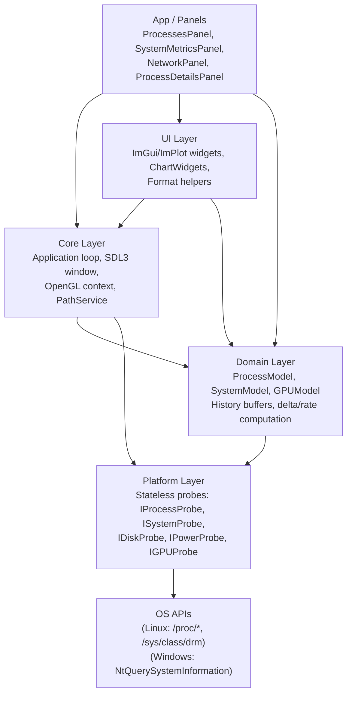

# Architecture

TaskSmack is organised as a strict five-layer stack. Each layer has clearly defined responsibilities and a fixed dependency direction — lower layers never depend on higher ones.

---

## Layer Diagram



---

## Layer Responsibilities

### `src/Platform/`

- Declares probe interfaces: `IProcessProbe`, `ISystemProbe`, `IDiskProbe`, `IPowerProbe`, `IGPUProbe`.
- Provides OS-specific implementations under `Linux/` and `Windows/`.
- **Stateless**: each probe call reads current OS counters and returns them — no state is kept between calls.
- Returns **raw counters** only (ticks, bytes). Rate computation belongs in Domain.
- Factory functions (`Platform::make*Probe()`) select the correct implementation at link time.

### `src/Domain/`

- Defines immutable snapshot types (`ProcessSnapshot`, `SystemSnapshot`, `GPUSnapshot`, …).
- Implements `History<T>` ring buffers and other bounded history containers for chart data.
- Owns `ProcessModel`, `SystemModel`, `GPUModel` — the delta/rate calculators.
- **No SDL3, OpenGL, or direct OS calls.** Fully deterministic and unit-testable with mock probes.
- Enforces cross-platform metrics semantics (CPU% calculation, PID-reuse handling via `hash(pid, startTime)`, I/O rates).

### `src/Core/`

- Owns the application loop and the layer stack.
- Creates and manages the SDL3 window and the OpenGL context.
- Provides `PathService` (the only place `Platform::makePathProvider()` is called).
- Contains minimal OpenGL usage for context creation only; rendering lives in UI.

### `src/UI/`

- Configures Dear ImGui and ImPlot (contexts, styling, and TOML-backed app persistence for layout, theme, and columns).
- Hooks the ImGui SDL3 and OpenGL3 backends.
- Provides shared widgets, table helpers, `ChartWidgets`, and `Format` utilities.
- Consumes **immutable domain snapshots**; never calls Platform APIs directly.
- All path resolution goes through `Core::Application::get().paths()`.

### `src/App/`

- Owns application panels: `ProcessesPanel`, `SystemMetricsPanel`, `NetworkPanel`, `ProcessDetailsPanel`, `GpuSection`, etc.
- Wires Domain models into UI rendering; drives refresh via `onUpdate(deltaTime)`.
- Implements the panel lifecycle: `onAttach`, `onDetach`, `onUpdate`, `render`.

---

## Dependency Direction

```
App / Panels
    ↓  (composes)
Core ←→ UI
    ↓
Domain
    ↑
Platform
    ↑
OS APIs
```

**Hard rules:**

- Domain depends only on Platform probe interfaces (`IProcessProbe`, `ISystemProbe`, `IDiskProbe`, `IPowerProbe`, `IGPUProbe`), not on Platform implementations or any Core/UI/App code.
- UI never calls Platform APIs directly.
- Platform never depends on UI, Core, or any renderer.
- All OpenGL calls are confined to `Core/` and `UI/` only.

---

## Composition Root Pattern

App panels are the **composition root**: the only place where `Platform::make*Probe()` and `Platform::makeProcessActions()` are called. This is intentional.

The distinction is **construction-time wiring** (allowed in panels) versus **runtime calls** (which must respect the layer rules):

| Layer | May call at `onAttach` / construction | May call at runtime |
|-------|--------------------------------------|---------------------|
| Platform | OS APIs | OS APIs |
| Domain | *(none — receives probes via constructor)* | Injected probe methods (`enumerate()`, `totalCpuTime()`, …) |
| Core | `Platform::makePathProvider()` via `PathService` | `PathService`, SDL3, OpenGL |
| App / Panels | `Platform::make*Probe()`, `Platform::makeProcessActions()` | Core, Domain snapshots, UI widgets |
| UI | *(none)* | ImGui, ImPlot, `Core::Application::get().paths()` |

**Rules derived from the matrix:**

- `Platform::makePathProvider()` is called **only** inside `Core::PathService`.
  All other path access goes through `Core::Application::get().paths()`.
- `Platform::make*Probe()` is called **only** from App panel `onAttach` / constructors.
  Never from rendering code or Domain.
- No new `#include "Platform/Factory.h"` should appear in `UI/` or non-panel `App/` files.

---

## Allowed Dependency Matrix

| From ↓ / To → | Platform | Domain | Core | UI | App |
|---------------|----------|--------|------|----|-----|
| **Platform** | ✅ | ❌ | ❌ | ❌ | ❌ |
| **Domain** | ✅ (via interface) | ✅ | ❌ | ❌ | ❌ |
| **Core** | ✅ (PathService only) | ✅ | ✅ | ❌ | ❌ |
| **UI** | ❌ | ✅ | ✅ (paths) | ✅ | ❌ |
| **App** | ✅ (onAttach only) | ✅ | ✅ | ✅ | ✅ |

---

## OpenGL + SDL3 Integration

- SDL3 manages window creation, input events, DPI scaling, framebuffer, and multi-viewport.
- OpenGL core profile 3.3+; only the renderer and the ImGui OpenGL3 backend issue GL calls.
- GLAD provides the OpenGL function loader, generated at CMake configure time via Python + jinja2.
- ImGui integrations: `imgui_impl_sdl3` for events, `imgui_impl_opengl3` for rendering.
- SDL3 events are polled each frame; panels react through ImGui input state — there is no custom event bus.

---

## Platform Strategy

### Linux

| Subsystem | Source |
|-----------|--------|
| Processes + CPU | `/proc/stat`, `/proc/[pid]/stat`, `/proc/[pid]/io` |
| Memory | `/proc/meminfo` |
| Network baseline | `/proc/net/*` |
| Network (high fidelity) | Netlink (`NETLINK_INET_DIAG`) |
| GPU — NVIDIA | NVML |
| GPU — AMD | ROCm SMI |
| GPU — Intel | DRM/sysfs |

### Windows

| Subsystem | Source |
|-----------|--------|
| Processes + CPU | `NtQuerySystemInformation` (SystemProcessInformation) |
| Memory | `GlobalMemoryStatusEx` |
| GPU — NVIDIA | NVML |
| GPU — all vendors | PDH Performance Counters, DXGI |

Each platform implements the same probe interfaces; automated tests ensure contract compliance.
