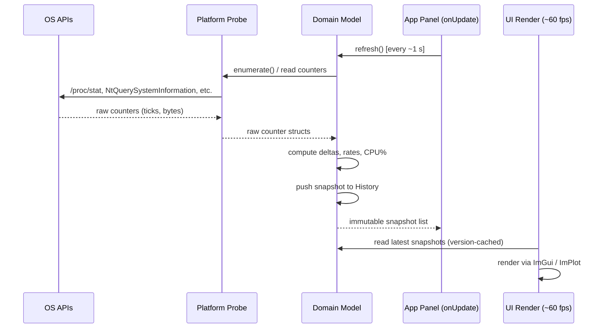

# Metrics Pipeline

This page describes how system metrics flow from OS APIs through Platform probes and Domain models into the UI — and why each boundary is designed the way it is.

---

## Pipeline Overview



---

## Probe → Domain Counter Flow

**Why probes are stateless:**

Platform probes do one thing: read current OS counters and return them. They keep no state between calls. This means:

- **Testability:** Domain calculation logic can be unit-tested by injecting mock probes with controlled counter values. No real OS is needed.
- **No `#ifdef` soup:** platform-specific code is isolated to probe implementations. Domain and tests are cross-platform.
- **Clean boundary:** the probe interface is the contract. Any OS that can implement the interface gets full metrics support.

```cpp
// Platform: returns raw counters (stateless OS read)
struct ProcessCounters {
    uint64_t userTime;       // cumulative CPU ticks
    uint64_t systemTime;
    uint64_t startTimeTicks; // for PID-reuse detection
    uint64_t rssBytes;
    // ...
};

// Domain: computes delta from previous snapshot
uint64_t cpuDelta = (cur.userTime + cur.systemTime)
                  - (prev.userTime + prev.systemTime);
float cpuPercent = static_cast<float>(cpuDelta)
                 / static_cast<float>(totalCpuDelta) * 100.0f;
```

---

## Delta and Rate Computation

Most metrics are **rates** (bytes/second, CPU%) derived from counter deltas over time. Domain models:

1. Store the previous counter snapshot in a map keyed by a **stable process identity**.
2. On each `refresh()`, compute `delta = current - previous` for each counter.
3. Divide by elapsed time (or by total CPU ticks for CPU%) to get a per-second rate.

### PID Reuse

PIDs are recycled by the OS. To avoid attributing a new process's counters to a dead process, the identity key is:

```
uniqueKey = hash(pid, startTimeTicks)
```

`startTimeTicks` is the process creation timestamp from the OS. Two processes with the same PID but different start times are treated as different processes. When a PID is recycled, the old entry is discarded and a fresh baseline is established.

---

## History Buffers and Retention

Domain models maintain scrolling history for time-series charts using bounded history containers. `History<T>` is a fixed-capacity ring buffer, and some models also use `std::deque` histories trimmed to the configured time window.

- **Bounded memory:** fixed-capacity ring buffers overwrite old samples when full, and deque-backed histories drop old samples once they fall outside the configured retention window.
- **What is stored:** percentages only, not raw byte totals. For example, `SystemModel` stores memory%, cached%, and swap% series — historical byte totals are not retained.

---

## Version-Cached Snapshot Reads

The UI render loop runs at ~60 fps. Domain `refresh()` runs at ~1 fps. To avoid deep-copying the full snapshot vector on every frame:

- Domain snapshots are published behind a **version counter**.
- The UI checks the version on each frame; if unchanged, it reuses the last rendered view without copying.
- Only when the version changes (a new `refresh()` completed) does the UI copy the new snapshots.

This keeps the 60 fps render path allocation-free for the common case.

---

## BackgroundSampler

`BackgroundSampler` (`src/Domain/BackgroundSampler.{h,cpp}`) is **implemented and tested but not yet active**.

Currently, panels call `model->refresh()` synchronously from `onUpdate()` on the main thread. The accumulator pattern ensures `refresh()` is only called when the configured interval (default 1 second) has elapsed.

`BackgroundSampler` is a future option to move probe enumeration off the main thread if UI responsiveness becomes a concern on systems with thousands of processes (enumeration can take several milliseconds on Linux when reading `/proc` for every process).

---

## Capability Reporting

Each probe reports what its platform supports via a `capabilities()` method:

```cpp
struct ProcessCapabilities {
    bool hasIoCounters = false;    // Linux: /proc/[pid]/io (requires root)
    bool hasThreadCount = false;
    bool hasStartTime = true;
};

struct SystemCapabilities {
    bool hasLoadAvg = false;       // Linux only
    bool hasIoWait = false;        // Linux only
    bool hasStealTime = false;     // Linux only (virtualisation)
};
```

The UI uses these capabilities to:

- **Hide unavailable columns/metrics automatically** — e.g., load average row hidden on Windows.
- **Show platform-appropriate tooltips** — e.g., "stop process" action hidden on Windows.
- **Avoid attempting unsupported operations** — no SIGSTOP on Windows.

This means the same UI code runs on both platforms; platform differences are data-driven, not guarded by `#ifdef`.

---

## Per-Metric Notes

### CPU%

CPU% is computed as:

```
cpu_percent = (user_delta + system_delta) / total_cpu_delta * 100
```

Where `total_cpu_delta` is the sum of all CPU time categories (user + system + idle + iowait + …) since the last sample. This matches `htop`'s semantics.

### Memory%

Memory% is `used / total * 100`. "Used" excludes cached/reclaimable pages. Both total and used are taken from the OS at sample time; only the percentage is stored in history.

### I/O Rates

Read and write rates are per-second deltas of cumulative byte counters:

```
read_bytes_per_sec = (cur.readBytes - prev.readBytes) / elapsed_seconds
```

On Linux, `/proc/[pid]/io` requires root or `CAP_DAC_READ_SEARCH`; if unavailable, I/O columns show `–`.

### Network Rates (Lifetime Averages)

Per-process network rates are **lifetime averages**, not instantaneous deltas:

```
net_sent_per_sec = total_bytes_sent_since_first_seen / elapsed_since_first_seen
```

This avoids instability for short-lived bursts. System-wide and per-interface rates are computed as short-interval deltas.

### GPU Utilisation

Per-process GPU utilisation is summed across all GPUs. On a two-GPU system a process actively using both GPUs can show GPU% up to 200 %. This is intentional — consistent with how multi-core CPU% works.
