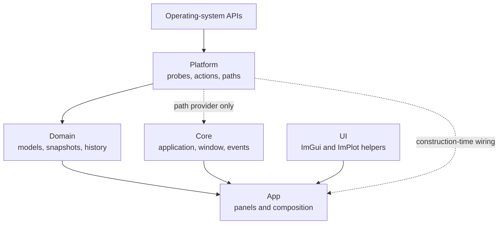

# TaskSmack Architecture

This document is the canonical description of TaskSmack's architecture and current engineering direction. User-facing behavior belongs in the [User Guide](docs/guide/user-guide.md), shipped features in [completed-features.md](completed-features.md), and developer commands in [CONTRIBUTING.md](CONTRIBUTING.md).

## Design Goals

- Keep operating-system access isolated and capability-aware.
- Derive rates and percentages from raw counters in testable domain models.
- Publish stable snapshots that UI code can render without touching platform APIs.
- Keep expensive process and GPU collection off the render path.
- Bound history and cache growth during long-running sessions.
- Preserve a single application target without sacrificing module boundaries.

## Layer Model



- Platform probes are stateless readers of OS counters.
- Process enumeration runs asynchronously on a background thread via `BackgroundSampler` to maintain UI responsiveness even with thousands of processes.
- System metrics (CPU, Memory, Network, Storage) are currently polled synchronously on the main thread via `onUpdate()`.
- Domain code transforms counters into snapshots and maintains history.
- UI (panels) consumes snapshots, renders views through ImGui/ImPlot, and never calls platform APIs directly.
- OpenGL usage is confined to Core/UI (SDL3 + ImGui backends).
- CPU percentage uses process CPU delta divided by total system CPU delta.
- Disk I/O and page-fault rates use consecutive sample deltas.
- Per-process network rates are lifetime averages from the first observed baseline.
- System and interface network rates use consecutive sample deltas.
- GPU data is merged into process snapshots when the platform can attribute usage.

The diagram shows runtime data flow. Compile-time dependencies are constrained more tightly: Domain depends on Platform interfaces, App is the composition root, and UI never depends on Platform.

### `src/Platform`

- Declares probe and action interfaces.
- Implements Linux and Windows access to process, system, disk, GPU, power, networking, and path APIs.
- Returns cumulative counters and capability flags rather than UI-ready rates.
- Contains no Domain, Core, UI, or App dependencies.

### `src/Domain`

- Owns `ProcessModel`, `SystemModel`, `StorageModel`, `GPUModel`, immutable snapshots, and bounded history.
- Converts cumulative counters into deltas, percentages, and rates.
- Handles counter rollback, PID reuse, sanity limits, and history retention.
- Depends only on Platform interfaces and the C++ standard library.

### `src/Core`

- Owns application startup, the main loop, the SDL3 window, events, and shutdown.
- Owns `PathService`, the only caller of `Platform::makePathProvider()`.
- Confines window-system and OpenGL context work to Core/UI boundaries.

### `src/UI`

- Owns Dear ImGui and ImPlot integration, themes, icons, shared widgets, charts, and formatting.
- May consume Domain snapshots and Core path services.
- Never creates probes or calls operating-system APIs.

### `src/App`

- Owns the shell, settings, title bar, panels, and user configuration.
- Creates Platform probes and injects them into Domain models.
- Coordinates sampling cadence, snapshot caching, selection, and rendering.
- Is the only general composition root for `Platform::make*Probe()` and process-action factories.

## Dependency Rules

| From | Allowed dependencies |
|------|----------------------|
| Platform | OS APIs and standard/third-party utility libraries |
| Domain | Platform interfaces |
| Core | Domain; Platform path provider through `PathService`; SDL3/OpenGL |
| UI | Domain; Core path access; ImGui/ImPlot/OpenGL |
| App | Platform factories, Domain, Core, and UI |

Hard rules:

- Platform probes return raw counters; Domain computes rates and percentages.
- Domain never includes Platform implementations or calls Platform factories.
- `Platform::makePathProvider()` is called only by `Core::PathService`.
- UI and non-panel App code do not include `Platform/Factory.h`.
- OpenGL calls remain in Core and UI.

## Sampling and Publication

Sampling is deliberately mixed according to workload:

1. `ProcessesPanel::onAttach()` creates a process probe, performs one synchronous seed read, and transfers probe ownership to `Domain::BackgroundSampler`.
2. `BackgroundSampler` uses `std::jthread` and `std::stop_token` to enumerate processes at the configured interval.
3. Its callback calls `ProcessModel::updateFromCounters()`, which computes process snapshots under synchronization and increments a snapshot version.
4. `ProcessesPanel` copies snapshots only when that version changes, avoiding render-frame deep copies.
5. `SystemMetricsPanel` refreshes system and storage models from its main-thread `onUpdate()` cadence.
6. GPU refresh runs on a dedicated `std::jthread`; the panel reads the latest GPU model state.
7. App rendering consumes cached snapshots and histories through ImGui/ImPlot.

The default interval is 1 second and can be configured from 100 ms to 5 seconds. History defaults to 5 minutes and is bounded from 10 seconds to 30 minutes. Shared defaults and clamps live in `src/Domain/SamplingConfig.h`.

### Process Identity and Rates

Process state is keyed by PID plus start time so PID reuse creates a fresh baseline. Domain models guard against counter rollback and implausible rates.

## Dependency Direction

```
App/UI
  ↓
Core
  ↓
Domain
  ↑
Platform
  ↑
OS APIs
```

Rules:
- Domain depends on nothing else.
- UI never calls platform APIs directly; use `Core::Application::get().paths()` for path resolution.
- Platform never depends on UI or renderer.
- OpenGL usage is confined to Core/UI only.

## Composition Root and Allowed Dependency Matrix

App panels serve as the **composition root**: they are the only place where Platform probes are
instantiated and injected into Domain models. This is intentional and correct—only App panels
have enough context to pair the right Platform implementation with the right Domain model.

The key distinction is **construction-time wiring** (allowed in App panels) vs **runtime calls**
(which must respect the layering rules):

| Layer | May call at construction / `onAttach` | May call at runtime |
|---|---|---|
| Platform | OS APIs | OS APIs |
| Domain | *(none — receives probes via constructor)* | injected probe interface methods (e.g. `enumerate()`, `totalCpuTime()`); never `Platform::make*()` factories |
| Core | `Platform::makePathProvider()` via `PathService` | `PathService`, SDL3, OpenGL |
| App / Panels | `Platform::make*Probe()`, `Platform::makeProcessActions()` | Core, Domain snapshots, UI widgets |
| UI | *(none)* | ImGui, ImPlot, `Core::Application::get().paths()` |

**Rules derived from the matrix:**

- `Platform::makePathProvider()` is called **only** inside `Core::PathService` (owned by `Application`).
  All path resolution elsewhere goes through `Core::Application::get().paths()`.
- `Platform::make*Probe()` and `Platform::makeProcessActions()` are called **only** from App panel
  `onAttach` / constructors (the composition root), never from UI rendering code or Domain.
- No new `#include "Platform/Factory.h"` should appear in `UI/` or non-panel `App/` code.

## UI Layer Model

- **ShellLayer:** docking root, main menu bar, global settings (refresh cadence, theme, column visibility), shared selection state.
- **ProcessesPanel:** process list with sorting and details selection.
- **ProcessDetailsPanel:** detailed view for the currently selected process.
- **SystemMetricsPanel:** plots and timelines backed by domain history.

## Sampling and Snapshot Pipeline

1. **System Panels** call `model->refresh()` on the main thread via `onUpdate()` at configurable intervals.
2. **Processes Panel** receives data from `BackgroundSampler`, which runs process enumeration on a dedicated background thread.
3. **Domain models** compute deltas and derived rates (CPU%, IO/s, etc), producing snapshots keyed by PID + start time and updating histories.
4. **UI render** reads the latest snapshots (version-cached to avoid redundant deep copies at ~60 fps) and renders via ImGui/ImPlot.

> **Note:** Process enumeration was moved to the `BackgroundSampler` thread to guarantee 60fps UI responsiveness on systems with thousands of processes.

## Process Scalability

To maintain 60fps UI responsiveness even with thousands of processes, TaskSmack applies the following constraints:
- **Stable Identity**: Uses a stable cache keyed by PID + start time to cleanly cope with PID reuse.
- **Background Tree Building**: Hierarchical process trees are built in the Domain layer during background sampling (`ProcessModel`), not on the UI thread. The `ProcessSnapshot` natively carries pre-computed `childrenIndices`.
- **Cached Filtering/Sorting**: Filtering and sorting indices are cached and only rebuilt when the data version or filter string changes, keeping the per-frame render loop strictly $O(V)$ where $V$ is the number of visible rows.

## OpenGL + SDL3 Integration Details

- SDL3 handles window creation, input, DPI, framebuffer scaling, and multi-viewport support.
- OpenGL core profile (3.3+); only the renderer and ImGui backend issue GL calls.
- GLAD provides the OpenGL function loader (generated at build time via Python + jinja2).
- ImGui integrations: `imgui_impl_sdl3` for events and `imgui_impl_opengl3` for rendering.
- SDL3 events are polled each frame; input is handled via ImGui input state.

### Capability Reporting

Probe capabilities describe whether fields such as I/O, command line, user, priority, network, GPU, and process status are available. Panels use those flags to hide unsupported columns and actions. Reduced-privilege detection can surface an elevation notice when elevation would restore data.

Capability absence is not an error. A supported platform may still omit metrics because of kernel configuration, permissions, hardware, drivers, or optional vendor libraries.

## Platform Strategy

### Linux

| Area | Primary sources |
|------|-----------------|
| Processes and CPU | `/proc/stat`, `/proc/[pid]/stat`, `/proc/[pid]/status`, `/proc/[pid]/io` |
| Memory | `/proc/meminfo`, process `statm`/status data |
| Network | `/proc/net/dev`, Netlink `INET_DIAG`, `/proc/[pid]/fd` ownership mapping |
| Storage | Linux block-device and filesystem interfaces |
| Power | `/sys/class/power_supply` |
| GPU | NVML for NVIDIA, ROCm SMI for AMD, DRM/sysfs for Intel and generic discovery |
| Process actions | POSIX signals, `setpriority`, affinity APIs |

Per-process I/O may require root or `CAP_DAC_READ_SEARCH`. Per-process network attribution requires Linux 4.2+ Netlink support.

### Windows

| Area | Primary sources |
|------|-----------------|
| Processes and CPU | `NtQuerySystemInformation` and process APIs |
| Memory | Windows memory and process-information APIs |
| Network | interface tables and TCP EStats |
| Storage and power | Windows system APIs |
| GPU | DXGI, NVML, and PDH |
| Process actions | `TerminateProcess`, priority classes, affinity APIs |

Per-process TCP byte counters use `GetPerTcpConnectionEStats` and require administrator privileges to enable collection. Windows does not expose Linux concepts such as load average, CPU steal time, or SIGSTOP/SIGCONT.

Only Linux and Windows are implemented. Windows builds target Windows 10 or later.

## Application and Rendering Lifecycle

`Core::Application` drains SDL3 events, updates layers, renders one frame, and presents it. Panels react to application events and ImGui input rather than polling SDL directly. Resize handling batches queued events before rendering and updates the viewport from framebuffer-size events.

The application throttles idle and minimized rendering. Domain and Platform code remain graphics-agnostic.

## Configuration and Paths

`App::UserConfig` persists TOML settings through platform-aware paths:

- Linux: `~/.config/tasksmack/config.toml`
- Windows: `%APPDATA%\TaskSmack\config.toml`

Configuration includes theme, font size, process columns, sampling interval, history duration, platform cache intervals, chart behavior, window state, and privilege-notice preference. User themes live in the adjacent `themes/` directory.

## Logging

TaskSmack uses spdlog with these conventions:

| Level | Use |
|-------|-----|
| `TRACE` | High-volume probe or frame diagnostics |
| `DEBUG` | Lifecycle details, refresh diagnostics, and state changes |
| `INFO` | Application lifecycle and major configuration changes |
| `WARN` | Graceful degradation or unavailable optional capabilities |
| `ERROR` | Recoverable failures that prevent a sample or operation |
| `CRITICAL` | Unrecoverable startup or runtime failure |

Render paths must not emit unthrottled logs. Repeated background-sampling failures are throttled, and tests silence routine logging.

## Testing Boundaries

- Platform contract tests verify probe and action semantics on each operating system.
- Domain tests inject mocks to verify calculations, history, rollback handling, and threading.
- App and UI tests cover configuration, panels, widgets, and formatting.
- Integration tests exercise cross-layer wiring and real platform probes.

The test and benchmark commands are documented only in [CONTRIBUTING.md](CONTRIBUTING.md).

## Current Engineering Direction

The core monitoring, process-control, GPU, network, storage, power, configuration, and theming paths are implemented. Future work should extend the existing contracts rather than bypass them. Candidate areas include service/startup management, handle and module inspection, a read-only remote API, and a versioned plugin boundary.

Do not treat roadmap items as shipped features; [completed-features.md](completed-features.md) is the canonical implemented-feature list.
