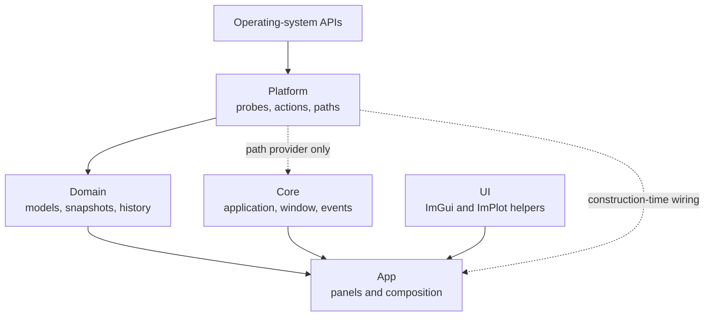

# TaskSmack Architecture

This document is the canonical description of TaskSmack's architecture and current engineering direction. User-facing behavior belongs in the [User Guide](docs/guide/user-guide.md), shipped features in [completed-features.md](completed-features.md), and developer commands in [CONTRIBUTING.md](CONTRIBUTING.md).

## Design Goals

- Keep operating-system access isolated and capability-aware.
- Derive rates and percentages from raw counters in testable domain models.
- Publish stable snapshots that UI code can render without touching platform APIs.
- Keep expensive process and GPU collection off the render path.
- Bound history and cache growth during long-running sessions.
- Preserve a single application target without sacrificing module boundaries.

## Layer Model


```mermaid
flowchart TD
    OS[Operating-system APIs]
    Platform[Platform<br/>probes, actions, paths]
    Domain[Domain<br/>models, snapshots, history]
    App[App<br/>panels and composition]
    UI[UI<br/>ImGui and ImPlot helpers]
    Core[Core<br/>application, window, events]

    OS --> Platform
    Platform --> Domain
    Domain --> App
    Core --> App
    UI --> App
    Platform -. construction-time wiring .-> App
    Platform -. path provider only .-> Core
```

- Platform probes read raw OS counters and never compute deltas or rates. They may keep implementation state that serves those reads: caches of raw readings and the bookkeeping a raw reading needs. On Linux, `LinuxProcessProbe` keeps a UID-to-username cache (one entry per UID seen, never evicted); each process's command line, keyed by PID, start time and comm, re-read within `PROCESS_CMDLINE_CACHE_TTL_MS` and dropped once the process is no longer listed; the socket inode-to-PID map, which `enumerate()` rebuilds every `INODE_PID_CACHE_TTL_MS` from the same `/proc/[pid]/fd` walk that counts FDs; the TCP socket query result, cached for `socket_stats_cache_ttl_ms` (default `SOCKET_STATS_CACHE_TTL_MS_DEFAULT`); and, for socket attribution, when each still-unowned socket was first seen (replaced by every reading).
- Process enumeration and heavy system metrics (System, Storage, GPU) run asynchronously on a background thread via `BackgroundSampler` (after an initial synchronous baseline read). This decoupled polling ensures UI responsiveness under heavy load.
- Domain code transforms counters into snapshots and maintains history.
- UI (panels) consumes snapshots, renders views through ImGui/ImPlot, and never calls platform APIs directly.
- OpenGL usage is confined to Core/UI (SDL3 + ImGui backends).
- CPU percentage uses process CPU delta divided by total system CPU delta.
- Disk I/O and page-fault rates use consecutive sample deltas.
- Per-process network rates use deltas between consecutive network readings. Where a probe reports raw per-connection byte counters (Linux), `ProcessModel` accumulates each connection's growth into monotonic per-process counters, so a connection closing doesn't make a rate drop and a connection attributed late never delivers its lifetime bytes as a spike. The growth a connection shows before it is attributed is held and credited to its owner once it is, so that recent growth (at most `UNATTRIBUTED_SOCKET_HOLD_MS` of it; a hold that outlasts the deadline is dropped) can still be concentrated into the interval in which the connection is attributed, and the Linux probe rebuilds its inode-to-PID map early (rate-limited by `INODE_PID_CACHE_EARLY_REBUILD_MS`) when a socket appears unowned after the last rebuild. A connection is credited to its owner by PID and start time when both are known, so a process that reuses a PID gets none of the old owner's traffic. That protection needs the owner's start time: the Linux probe reports it (unless its `stat` read fails), Windows reports none, and a connection whose owner start time is unknown is matched by PID alone.
- System and interface network rates use consecutive sample deltas.
- GPU data is merged into process snapshots when the platform can attribute usage.

The diagram shows runtime data flow. Compile-time dependencies are constrained more tightly: Domain depends on Platform interfaces, App is the composition root, and UI never depends on Platform.

### `src/Platform`

- Declares probe and action interfaces.
- Implements Linux and Windows access to process, system, disk, GPU, power, networking, and path APIs.
- Returns cumulative counters and capability flags rather than UI-ready rates.
- Contains no Domain, Core, UI, or App dependencies.

### `src/Domain`

- Owns `ProcessModel`, `SystemModel`, `StorageModel`, `GPUModel`, immutable snapshots, and bounded history.
- Converts cumulative counters into deltas, percentages, and rates.
- Handles counter rollback, PID reuse, sanity limits, and history retention.
- Depends only on Platform interfaces and the C++ standard library.

### `src/Core`

- Owns application startup, the main loop, the SDL3 window, events, and shutdown.
- Owns `PathService`, the only caller of `Platform::makePathProvider()`.
- Confines window-system and OpenGL context work to Core/UI boundaries.

### `src/UI`

- Owns Dear ImGui and ImPlot integration, themes, icons, shared widgets, charts, and formatting.
- All history charts render through the shared `HistoryChart` RAII helper (`ChartWidgets.h`), which applies the chart font, legend, time axis, Y-axis formatter, and locked-vs-auto-fit Y policy in one place.
- `RenderMetrics` captures per-chart vertex counts and CPU time when the Render Metrics overlay (Ctrl+Shift+M) is open; recording is a no-op branch otherwise. Per-chart indices are deliberately not captured (see #908); the overlay's frame-level total still reports ImGui's own index count.
- May consume Domain snapshots and Core path services.
- Never creates probes or calls operating-system APIs.

### `src/App`

- Owns the shell, settings, title bar, panels, and user configuration.
- Creates Platform probes and injects them into Domain models.
- Coordinates sampling cadence, snapshot caching, selection, and rendering.
- Is the only general composition root for `Platform::make*Probe()` and process-action factories.

## Dependency Rules

| From | Allowed dependencies |
|------|----------------------|
| Platform | OS APIs and standard/third-party utility libraries |
| Domain | Platform interfaces |
| Core | Domain; Platform path provider through `PathService`; SDL3/OpenGL |
| UI | Domain; Core path access; ImGui/ImPlot/OpenGL |
| App | Platform factories, Domain, Core, and UI |

Hard rules:

- Platform probes return raw counters; Domain computes rates and percentages.
- Domain never includes Platform implementations or calls Platform factories.
- `Platform::makePathProvider()` is called only by `Core::PathService`.
- UI and non-panel App code do not include `Platform/Factory.h`.
- OpenGL calls remain in Core and UI.

## Sampling and Publication

Sampling is deliberately mixed according to workload:

1. `ProcessesPanel::onAttach()` creates a process probe and `ProcessModel`, performs one synchronous seed read, and adds the model to a `BackgroundSampler`.
2. `SystemMetricsPanel::onAttach()` creates System, Storage, and GPU models, seeds them, and adds them to its own `BackgroundSampler`.
3. Each `BackgroundSampler` uses `std::jthread`, `std::stop_token`, and a condition variable to call `sample()` at the configured interval and wake immediately for refresh, interval, or stop requests.
4. Domain models compute deltas under a sampling lock, producing snapshots keyed by PID/time and updating histories.
5. System, Storage, and GPU models atomically publish immutable versioned snapshot-and-history generations; ProcessModel publishes a monotonic snapshot version.
6. Panels retain those generations and rebuild process filter/sort caches only when versions change, avoiding render-frame locks and deep copies.
7. Process Details records history once per ProcessModel publication rather than once per UI timer tick, so adaptive sampling cannot duplicate stale values. `ProcessModel::watchProcess()` keeps a shared sample of the selected process from every publication (the last 64), each stamped with the time the generation was sampled; the details pane takes in every sample newer than its last, so generations published between two frames are not lost and its charts share the Overview's timebase. A frame with nothing new costs one atomic load and copies no snapshot.

The default interval is 1 second and can be configured from 100 ms to 5 seconds. History defaults to 5 minutes and is bounded from 10 seconds to 30 minutes. Shared defaults and clamps live in `src/Domain/SamplingConfig.h`.

### Process Identity and Rates

Process state is keyed by PID plus start time so PID reuse creates a fresh baseline. Domain models guard against counter rollback and implausible rates.

A per-process value the probe could not read (on Linux, for another user's process: its FD count without `CAP_DAC_READ_SEARCH`, which lists `/proc/[pid]/fd`; its I/O and network attribution without `CAP_SYS_PTRACE` as well, which `/proc/[pid]/io` and the fd links need -- root has both unless they are dropped) is flagged unavailable in `ProcessCounters`/`ProcessSnapshot` (`handleCountAvailable`, `ioAvailable`, `networkAvailable`). A rate needs both readings it is taken between. Unavailable values are shown as N/A and as gaps in the charts, and they are left out of the system totals rather than counted as 0.

## Dependency Direction

```
App/UI
  ↓
Core
  ↓
Domain
  ↑
Platform
  ↑
OS APIs
```

Rules:
- Domain depends on nothing else.
- UI never calls platform APIs directly; use `Core::Application::get().paths()` for path resolution.
- Platform never depends on UI or renderer.
- OpenGL usage is confined to Core/UI only.

## Composition Root and Allowed Dependency Matrix

App panels serve as the **composition root**: they are the only place where Platform probes are
instantiated and injected into Domain models. This is intentional and correct—only App panels
have enough context to pair the right Platform implementation with the right Domain model.

The key distinction is **construction-time wiring** (allowed in App panels) vs **runtime calls**
(which must respect the layering rules):

| Layer | May call at construction / `onAttach` | May call at runtime |
|---|---|---|
| Platform | OS APIs | OS APIs |
| Domain | *(none — receives probes via constructor)* | injected probe interface methods (e.g. `enumerate()`, `totalCpuTime()`); never `Platform::make*()` factories |
| Core | `Platform::makePathProvider()` via `PathService` | `PathService`, SDL3, OpenGL |
| App / Panels | `Platform::make*Probe()`, `Platform::makeProcessActions()` | Core, Domain snapshots, UI widgets |
| UI | *(none)* | ImGui, ImPlot, `Core::Application::get().paths()` |

**Rules derived from the matrix:**

- `Platform::makePathProvider()` is called **only** inside `Core::PathService` (owned by `Application`).
  All path resolution elsewhere goes through `Core::Application::get().paths()`.
- `Platform::make*Probe()` and `Platform::makeProcessActions()` are called **only** from App panel
  `onAttach` / constructors (the composition root), never from UI rendering code or Domain.
- No new `#include "Platform/Factory.h"` should appear in `UI/` or non-panel `App/` code.

## UI Layer Model

- **ShellLayer:** main tabs, global settings (refresh cadence, theme, column visibility), shared selection state. A `PanelTabs` registry binds each shell-owned panel to its event name and cached-label provider in one constructor list. The registry owns its event-name strings and provider callables, but references panels without owning them; panels and objects referenced by provider captures must outlive the registry. The first registration is the default tab; registration order drives tab display, attach, update, and event forwarding, with reverse-order detach. `Panel::renderContent()` renders the selected tab without a window wrapper. Cross-panel model sharing and selected-process snapshot updates remain explicit shell coordination.
- **ProcessesPanel:** process list with sorting and details selection.
- **ProcessDetailsPanel:** detailed view for the currently selected process.
- **SystemMetricsPanel:** plots and timelines backed by domain history.

## Sampling and Snapshot Pipeline

1. **Panels** (Processes, System Metrics) create their respective Domain models (Process, System, Storage, GPU).
2. **Background Samplers** are spun up per panel: process enumeration has one worker, while System, Storage, and GPU share a second worker and failure domain.
3. **Domain models** compute deltas and derived rates (CPU%, IO/s, etc), producing snapshots keyed by PID + start time and updating histories under a lock.
4. **Publication** atomically exposes immutable, versioned snapshot-and-history generations after a complete sample.
5. **UI render** retains the latest publication (or process snapshot version) and renders it via ImGui/ImPlot without per-frame model locks or history copies.

> **Note:** Enumeration and sampling was moved to `BackgroundSampler` threads to guarantee 60fps UI responsiveness on systems with thousands of processes or heavy IO operations.

## Process Scalability

To maintain 60fps UI responsiveness even with thousands of processes, TaskSmack applies the following constraints:
- **Stable Identity**: Uses a stable cache keyed by PID + start time to cleanly cope with PID reuse.
- **Background Tree Building**: Hierarchical process trees are built in the Domain layer during background sampling (`ProcessModel`), not on the UI thread. The `ProcessSnapshot` natively carries pre-computed `childrenIndices`. Parent/child links additionally require the candidate parent's start time to be at or before the child's, so a PID recycled to an unrelated process between the two `/proc` reads that produced a sample can't be mistaken for the real parent.
- **Cached Filtering/Sorting**: Filtering and sorting indices are cached and only rebuilt when the data version or filter string changes, keeping the per-frame render loop strictly $O(V)$ where $V$ is the number of visible rows.

## OpenGL + SDL3 Integration Details

- SDL3 handles window creation, input, DPI, framebuffer scaling, and multi-viewport support.
- OpenGL core profile (3.3+); only the renderer and ImGui backend issue GL calls.
- GLAD provides the OpenGL function loader (generated at build time via Python + jinja2).
- ImGui integrations: `imgui_impl_sdl3` for events and `imgui_impl_opengl3` for rendering.
- SDL3 events are polled each frame; input is handled via ImGui input state.

### Capability Reporting

Probe capabilities describe whether fields such as I/O, command line, user, priority, network, GPU, and process status are available. Panels use those flags to hide unsupported columns and actions. Reduced-privilege detection can surface an elevation notice when elevation would restore data.

Capability absence is not an error. A supported platform may still omit metrics because of kernel configuration, permissions, hardware, drivers, or optional vendor libraries.

## Platform Strategy

### Linux

| Area | Primary sources |
|------|-----------------|
| Processes and CPU | `/proc/stat`, `/proc/[pid]/stat`, `/proc/[pid]/status`, `/proc/[pid]/io` |
| Memory | `/proc/meminfo`, process `statm`/status data |
| Network | `/proc/net/dev`, Netlink `INET_DIAG`, `/proc/[pid]/fd` ownership mapping |
| Storage | Linux block-device and filesystem interfaces |
| Power | `/sys/class/power_supply` |
| GPU | NVML for NVIDIA, ROCm SMI for AMD, DRM/sysfs for Intel and generic discovery |
| Process actions | POSIX signals, `setpriority`, affinity APIs |

For other users' processes, per-process I/O and network attribution need `CAP_DAC_READ_SEARCH` plus `CAP_SYS_PTRACE` in the effective set (reading `/proc/[pid]/io` and the `/proc/[pid]/fd/*` links is checked with `PTRACE_MODE_READ_FSCREDS`) — root with its normal capabilities has them, but root alone isn't enough where capabilities are dropped (a container or hardened service); FD counts need only `CAP_DAC_READ_SEARCH` (listing `/proc/[pid]/fd` is a plain permission check). Per-process network attribution requires Linux 4.2+ Netlink support.

### Windows

| Area | Primary sources |
|------|-----------------|
| Processes and CPU | `NtQuerySystemInformation` and process APIs |
| Memory | Windows memory and process-information APIs |
| Network | interface tables and TCP EStats |
| Storage and power | Windows system APIs |
| GPU | DXGI, NVML, and PDH |
| Process actions | `TerminateProcess`, priority classes, affinity APIs |

Per-process TCP byte counters use `GetPerTcpConnectionEStats` and require administrator privileges to enable collection. Without them no process's network bytes are read, so each process reports them unavailable (N/A) rather than 0; handle counts and I/O bytes come from the bulk snapshot and are read for every process (#1285). Windows does not expose Linux concepts such as load average, CPU steal time, or SIGSTOP/SIGCONT.

Process enumeration takes one bulk `NtQuerySystemInformation(SystemProcessInformation)` snapshot per sample, which supplies CPU times, memory, I/O, handle/thread counts, thread states, base priorities, and image names for every process without opening per-process handles. The process state letter is derived from the thread states (R: a thread runs or is ready; T: every thread suspended; S: otherwise; I: the System Idle Process; never Z). Slower-changing details are refreshed through short-lived process handles on RAM-tuned TTLs: status and GDI objects on the light one; owner, command line (`ProcessCommandLineInformation`, else the image path), publisher, affinity, and classification on the heavy one. The priority class is read with the heavy details and again as soon as the snapshot's base priority changes, so a priority change shows on the next sample (#1156).

Only Linux and Windows are implemented. Windows builds target Windows 10 or later.

## Application and Rendering Lifecycle

`Core::Application` drains SDL3 events, updates layers, renders one frame, and presents it. Panels react to application events and ImGui input rather than polling SDL directly. Resize handling batches queued events before rendering and updates the viewport from framebuffer-size events.

The application throttles idle and minimized rendering. Domain and Platform code remain graphics-agnostic.

Custom title-bar behavior is intentionally platform-specific:

- **Windows:** Client-side drag and resize interactions (`TitleBarLayer`) with resize cursors applied from the app.
- **Linux (X11/XWayland):** Delegates border resize to window manager via `SDL_HITTEST_RESIZE_*` results.
  - Title-bar drag uses event-consistent coordinates (`window position + event-local mouse`), client-side, same as Windows.
  - Window maximize asks the window manager (`SDL_MaximizeWindow`) when it supports EWMH maximize (`_NET_SUPPORTED` lists `_NET_WM_STATE_MAXIMIZED_VERT`/`_HORZ`, read by `Core::X11WindowManager`), so it fills the window manager's work area; `SDL_GetDisplayUsableBounds` is the whole display on a server without `_NET_WORKAREA` (WSLg), which covered the taskbar (#1339). Without EWMH maximize it falls back to client-side positioning with `SDL_GetDisplayUsableBounds`. The decision is `WindowGeometry::chooseBorderlessMaximize()`; Windows always maximizes client-side (#1208).
- **Linux (native Wayland):** Prefers compositor-managed window interactions.
  - Title-bar drag delegates to the compositor via `SDL_HITTEST_DRAGGABLE` (-> `xdg_toplevel_move()`) rather than client-side `SDL_SetWindowPosition()`, which Wayland doesn't support for absolute positioning (#744). This consumes the button-down event entirely, so double-click-to-maximize does not fire from the title bar on native Wayland -- the maximize button remains available there.
  - Window maximize/restore delegates to compositor via `SDL_MaximizeWindow`/`SDL_RestoreWindow` instead of manual client-side positioning.
  - Border resize remains delegated to window manager.
  - Resize-border **cursor** hover feedback is client-side on every platform (`TitleBarLayer::updateResizeCursor()`), including native Wayland: the compositor only shows a resize cursor during an active hit-test-triggered drag, not on hover, so the app supplies it. Must not force the cursor to default when `SDL_GetMouseFocus()` transiently disagrees during a WM/compositor-owned interaction, or it fights the WM's own cursor (#749).
- **Opt-in escape hatch:** `UserConfig`'s `forceNativeWindowDecorationsOnWayland` (Settings > Advanced, native-Wayland builds only) switches to native OS/compositor window decorations instead of the custom title bar, for anyone who prefers that over the behavior above. Off by default; takes effect on next launch (#745). When active, `App::TitleBarLayer` is not pushed at all (`main.cpp`) and `ShellLayer` reserves zero space for it, so the custom chrome is fully replaced rather than doubled up; since that also removes the title bar's Settings/Help buttons (there is no other menu), the status bar (`ShellLayer::renderStatusBar()`) surfaces equivalent buttons in that mode.

Backend detection is centralized in `Core::VideoBackend`:
- Detects whether the current video driver is native Wayland, X11, XWayland (X11 on Wayland), or Windows.
- Provides semantic capability queries (`supportsClientSideMaximize`, `supportsGlobalMouseState`) used by `Window` and `TitleBarLayer`.
- Initialized once after SDL_Init in the Application constructor.

XWayland is detected as a first-class fallback path (SDL driver `"x11"` with `WAYLAND_DISPLAY` set -- `DISPLAY` isn't consulted, since it's commonly set on native Wayland sessions too) and is treated like X11 for compatibility.

## Configuration and Paths

`App::UserConfig` persists TOML settings through platform-aware paths:

- Linux: `~/.config/tasksmack/config.toml`
- Windows: `%APPDATA%\TaskSmack\config.toml`

Configuration includes theme, font size, process columns, sampling interval, history duration, platform cache intervals, chart behavior, window state, and privilege-notice preference. User themes live in the adjacent `themes/` directory.

## Logging

TaskSmack uses spdlog with these conventions:

| Level | Use |
|-------|-----|
| `TRACE` | High-volume probe or frame diagnostics |
| `DEBUG` | Lifecycle details, refresh diagnostics, and state changes |
| `INFO` | Application lifecycle and major configuration changes |
| `WARN` | Graceful degradation or unavailable optional capabilities |
| `ERROR` | Recoverable failures that prevent a sample or operation |
| `CRITICAL` | Unrecoverable startup or runtime failure |

Render paths must not emit unthrottled logs. Repeated background-sampling failures are throttled, and tests silence routine logging.

## Testing Boundaries

- Platform contract tests verify probe and action semantics on each operating system.
- Domain tests inject mocks to verify calculations, history, rollback handling, and threading.
- App and UI tests cover configuration, panels, widgets, and formatting.
- Integration tests exercise cross-layer wiring and real platform probes.

The test and benchmark commands are documented only in [CONTRIBUTING.md](CONTRIBUTING.md).

## Current Engineering Direction

The core monitoring, process-control, GPU, network, storage, power, configuration, and theming paths are implemented. Future work should extend the existing contracts rather than bypass them. Candidate areas include service/startup management, handle and module inspection, a read-only remote API, and a versioned plugin boundary.

Do not treat roadmap items as shipped features; [completed-features.md](completed-features.md) is the canonical implemented-feature list.
